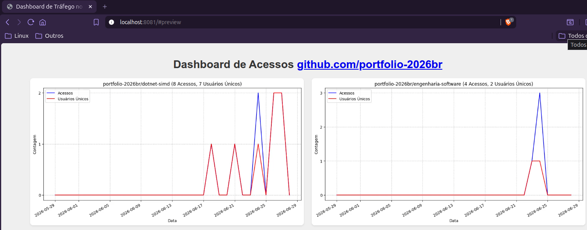
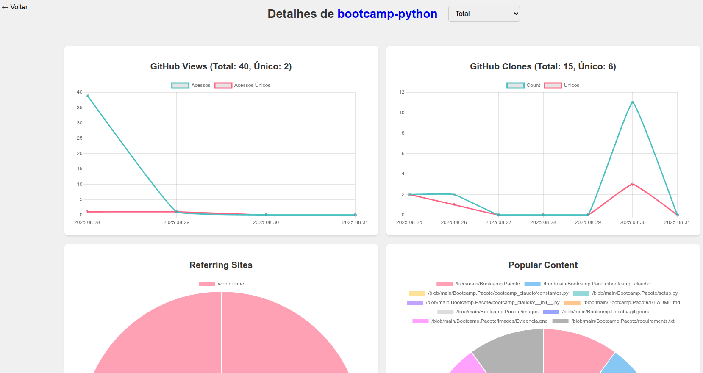

# Dashboard de Acessos

Evidências que comprovam minha experiênca como desenvolvedor e minha capacidade de pensar em novas soluções.

## Contexto

Baseado em exemplos da comunidade desenvolvi um Dashboard do tráfego no GitHub.

## Solução

Para visualizar as estatísticas de acesso aos repositórios do GitHub eu desenvolvi uma interface web simples usando
HTML, CSS e JavaScript. Esta interface pode ser usada localmente ou hospedada na Web, por exemplo, no GitHub Pages. Eu
uso localmente.

Como os dados são armazenados localmente, isto nos permite manter o histórico por um período superior aos 14 dias
oferecidos pelo GitHub.

Foram usados CLI do GitHub, HTML e JavaScript. O backend foi desenvolvido em Python.

Pontos a destacar na minha solução:

### Página Principal

- O Dashboard:

### Detalhamento

- Exemplo de histórico de acessos a um dos repositórios no GitHub:

