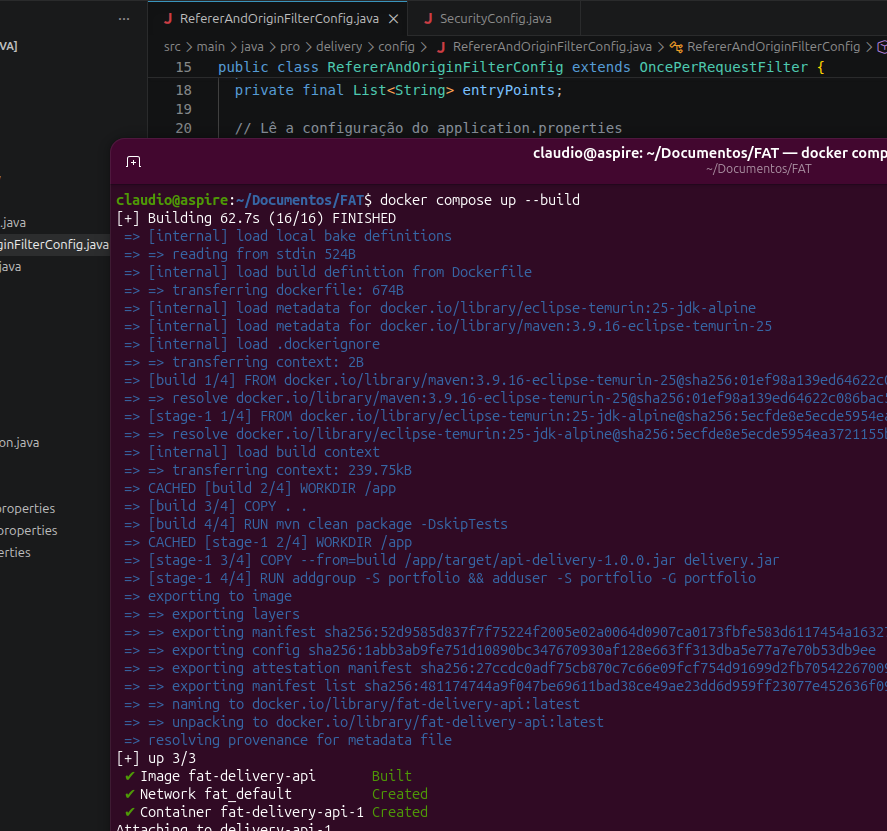
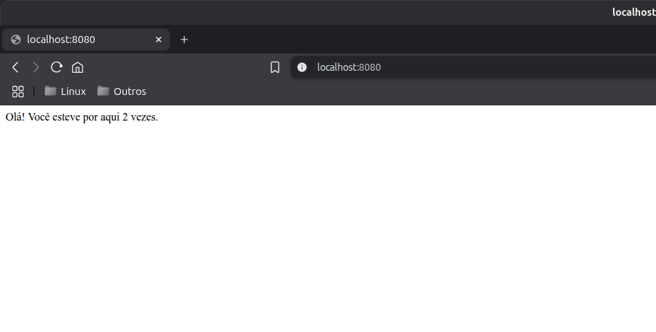
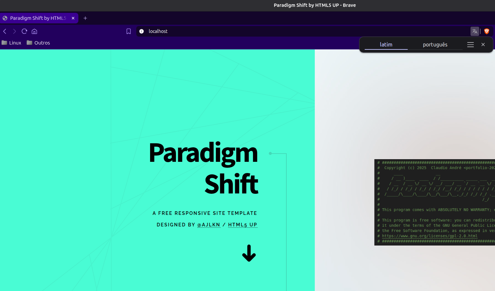

# Uso do Docker

Evidências que comprovam minha experiênca com o uso de Docker.

## Contexto

Utilizar o Docker Compose e contâineres para executar e orquestrar aplicações WEB que acessam banco de dados.

## Solução

Pontos a destacar na minha solução:

### Aplicação Java Real

- Uso de Java com Spring acessando banco de dados relacional; ORM, JWT, CORS, ...;

- Aplicação pronta para deploy (cache, banco de dados, segurança, Docker, orquestração, ...);

### Exemplo de Conteúdo Dinâmico

- Criação de um contador de acessos simples usando Redis:
  - Python + Flask acessando o redis.

### Exemplo de Conteúdo Estático

- Uso de Apache para servir páginas HTML 5 estáticas;

